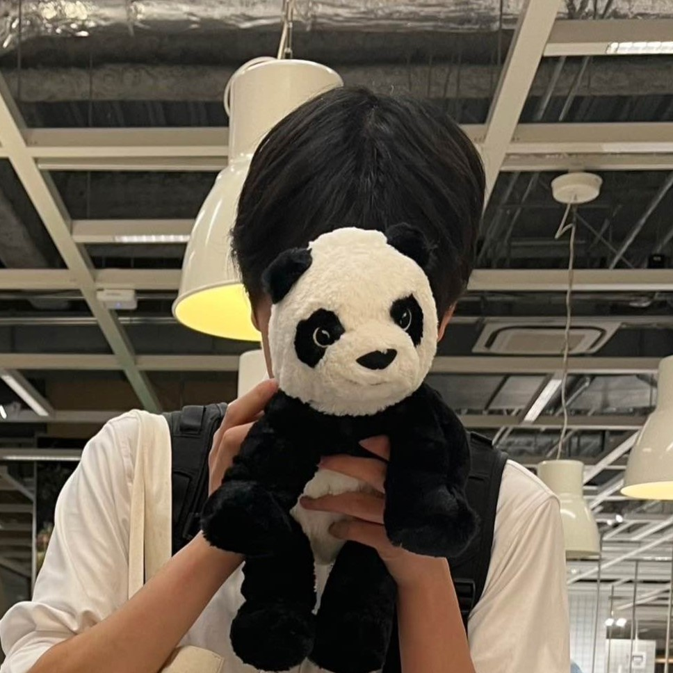
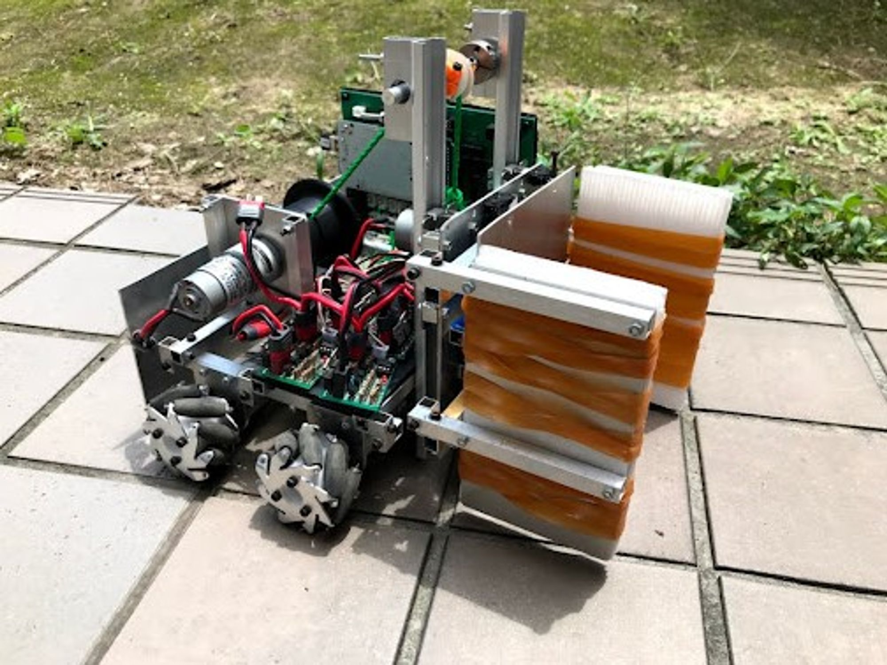
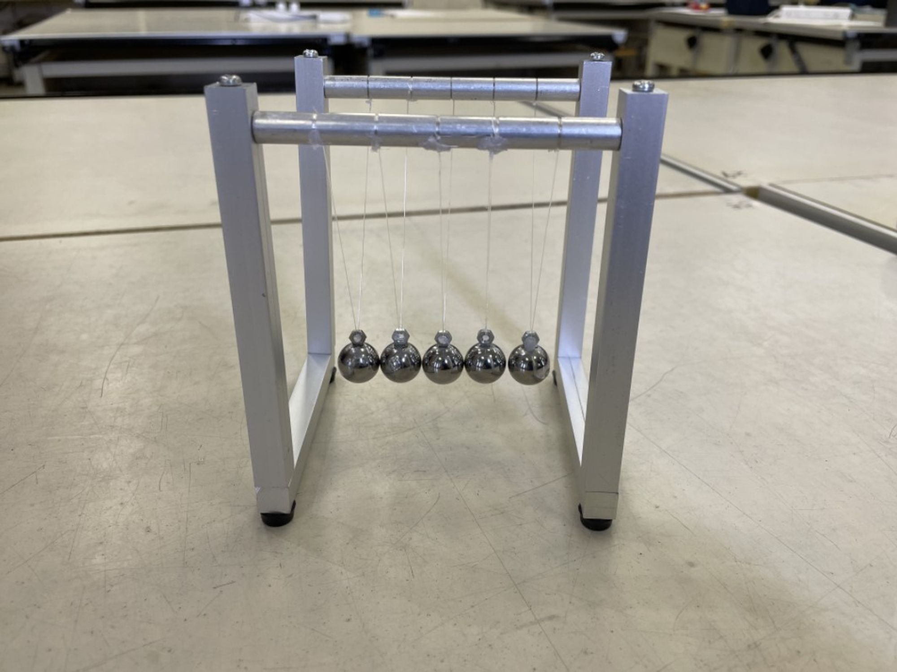
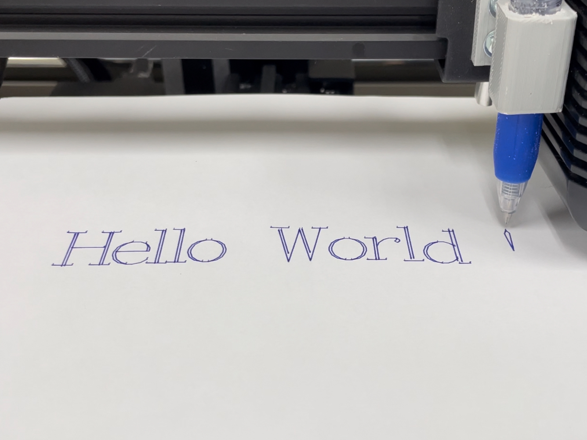
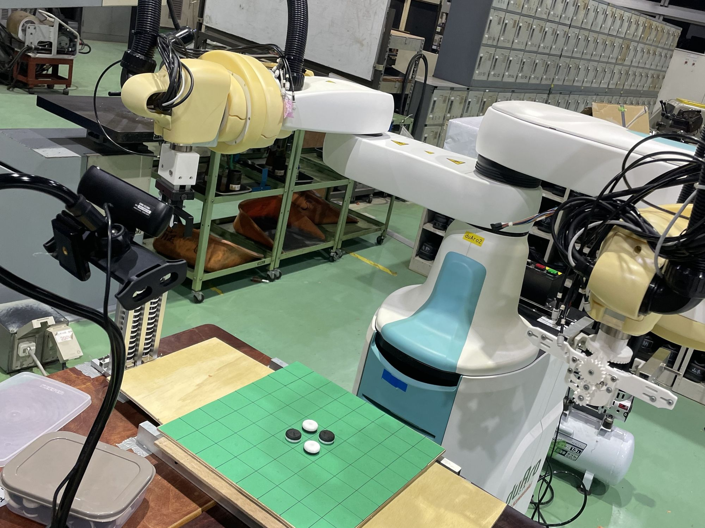
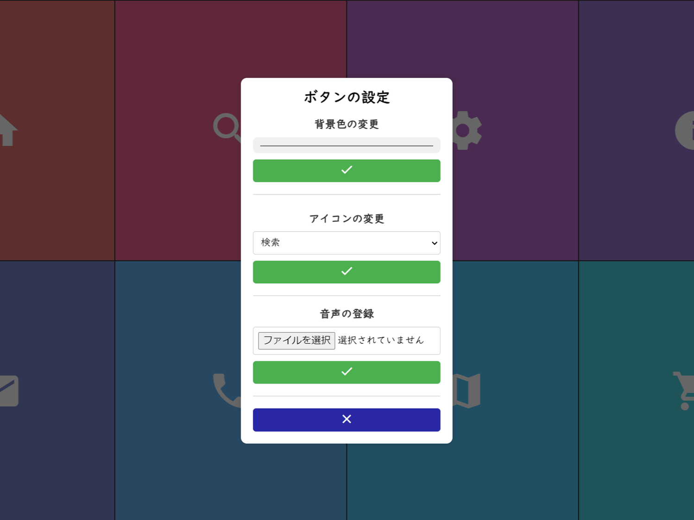
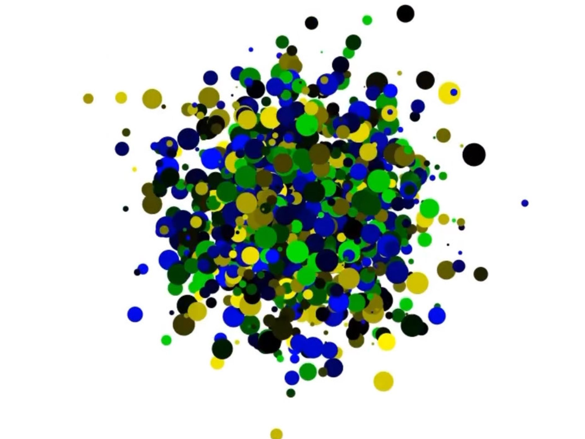
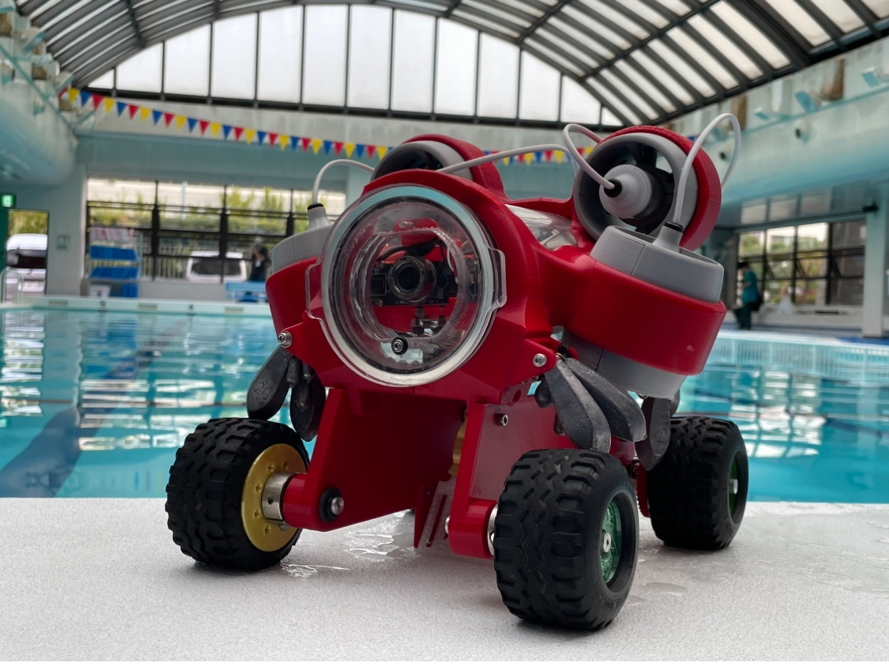

# My Portfolio - Megumu Isshiki

**Last Edit: 14/04/2025**

[**日本語版はこちら**](https://www.notion.so/My-Portfolio-Megumu-Isshiki-ed8bcdb6ef404b84b8a0493113e4604e?pvs=21)

# Introduction

---

**Field of interest**: Human Computer Interaction, Tangible User Interface, More Than Human

**Affiliation**: Division of Computer Science and Information Technology, Hokkaido University

🕊 [Facebook](https://www.facebook.com/profile.php?id=100035212147481&sk=about) | #️⃣ [Instagram](https://www.instagram.com/davinci_kcct/) | 💻 [GitHub](https://github.com/Davinci-Meg) | 📽️ [YouTube](https://youtube.com/@davinci_meg?si=iP2BZzgEu1kXAaiZ)

# Awards & Honors

---

### **Year 2019**

- Kobe Ambassador Exchange to Seattle 2019 : [URL](https://www.kobe-kosen.ac.jp/kokusai/)
- The 64th YFU Intercultural Exchange Programs (One-year Studying Abroad in Germany) : [URL](https://yfu.or.jp/)

### **Year 2023**

- 5th Place & Best Presentation Award in Techno-Ocean 2023 Underwater Robot Competition AUV division (as a team) : [URL](http://ton23.underwaterrobonet.org/)
- Excellence Award in National KOSEN Design Competition -AM Design Division (as a team) : [URL](https://xn--tckf4c8j.com/docs.php?n=bumon4_kekka.pdf)
- Special Award in The 17th Annual English Presentation Contest for College of Technology in the Kinki District : [URL](http://cocet.org/precon/2023/prelim.html)
- Diversity & Inclusion Encouragement Award in National KOSEN GIRLs SDGs x Technology Contest (as a team) : [URL](https://gcon.kosen-k.go.jp/news/oDMPkYlf)

### **Year 2024**

- Accepted A Paper at The 28th Symposium of the IPSJ INTERACTION 2024 : [URL](https://www.interaction-ipsj.org/2024/)
- National Institute of Informatics Science and Technology Challenge Program for Next Generation "情報科学の達人プログラム” 5th gen : [URL](https://www.nii.ac.jp/tatsujin/en/)
- Demo Presentation at The 28th Symposium of the IPSJ INTERACTION 2024 : [URL](https://www.interaction-ipsj.org/2024/)
- Project of the Year 2024/3DEXPERIENCE Edu, SOLIDWORKS prize (as a team) : [URL](https://youtu.be/M5Tu90vtmLs?si=zgNnyMZ5u8CpYRZi)
- 高専キャリア起業部2024 夏の全国大会 起業部ピッチ ソフトバンク賞：[URL](https://x.com/kosen_career/status/1830140405280882815?s=46)
- 高専キャリア起業部2024 夏の全国大会 起業部ピッチ DEEPCORE賞：[URL](https://x.com/kosen_career/status/1830140608717209895?s=46)
- KANSAI Tech Creator Challenge - Cybernetic Avatar Intensive Course Kansai Tech Creator Challenge Award (Team) : [URL](https://kansai-tcc.dle.or.jp/ca2024/)
- The Ministry of Economy, Trade and Industry, FY2023 Support Program for the Discovery and Development of Young Talent in Regional Areas, Subsidy Project “AKATSUKI Project” Selected Initiative: “Kansai Tech Creator Challenge - CA Course” Selection (Selected funding amount: 550,000 yen): [URL](https://kansai-tcc.dle.or.jp/ca2024/)
- GUGEN2024 Student Award：[URL](https://x.com/GugenTheIdea/status/1867847196626014530)

### Year 2025

- Kobe City College of Technology The 43st Annual English Speaking Competition 1st Prize：[URL](https://www.kobe-kosen.ac.jp/activity/15155/)
- General Incorporated Association ****Kobe City Machinery and Metal Industry Association President’s Award：[URL](https://www.kobe-kosen.ac.jp/activity/14799/)
- Best Award at the Special Session Poster Presentation of the 87th National Conference of the Information Processing Society of Japan “情報科学の達人 5.0”：[URL](https://x.com/Davinci_kcct/status/1913796393355059583)
- Selected as a 5th Cohort Member of the Hybrid Innovator Human Resource Development Program by Ezofrogs (Selected Project under the Ministry of Economy, Trade and Industry's 'AKATSUKI Project')：[URL](https://x.com/ezofrogs/status/1939332444534280270)
- STARTUP HOKKAIDO Collaborative Lecture: 'Develop Future Skills to Understand Social Issues and Thrive in the Future' Final Pitch - Best Award & MVP Award：[URL](https://hokkaido-innovation-hunter.my.canva.site/futureskills)

# Publication

---

- 一色潤,高田崚介, 3D CAD操作支援のための巻き尺を用いたサイズ感提示デバイスの開発, インタラクション2024, 巻, 号, pp. 59 -

# Technical Skills

---

- Programming Languages: Python, C#
- Prototyping: Arduino, Fusion360, SolidWorks, Processing, Touch Designer
- Fabrication: 3D Printing

# Media Coverage

---

- Dassault Systèmes SolidWorks Corporation, “Japan Underwater Robot Team Wins Dassault Systemes POTY2024 SOLIDWORKS Brand Prize”, [URL](https://blogs.solidworks.com/teacher/2024/07/japan-underwater-robot-team-wins-solidworks-brand-prize-poty2024.html)

# Other Activities

---

- 高専キャリア起業部2024 夏の全国大会 「高専卒業後のキャリアパス、就職 or 大学編入？」Speaker：[URL](https://x.com/kosen_career/status/1825138675342295134)
- 高専キャリア起業部2024 夏の全国大会 「動き出せ！高専生の挑戦記」Speaker：[URL](https://x.com/kosen_career/status/1828338096297124284)
- DevFest2024 - Kwansai Developers Day Speaker：[URL](https://x.com/gdgkwansai/status/1869714299440021886)
- 高専キャリア2024 冬の全国大会「進学でも、就職でもない選択肢」Speaker：[URL](https://x.com/kosen_career/status/1870323844982112421)
- 高専キャリア全国大会 2025 SPRING「「1歩目に悩むあなたへ」コンテストで世界はどう広がる？」Speaker：[URL](https://x.com/kosen_career/status/1897226559351845371)

# Creations

---

<aside>
💡 Copyright, Megumu Isshiki, All rights reserved.

</aside>