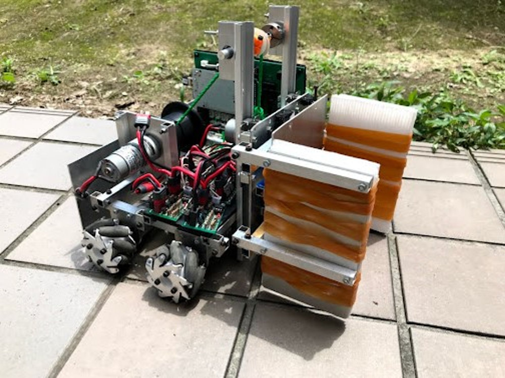
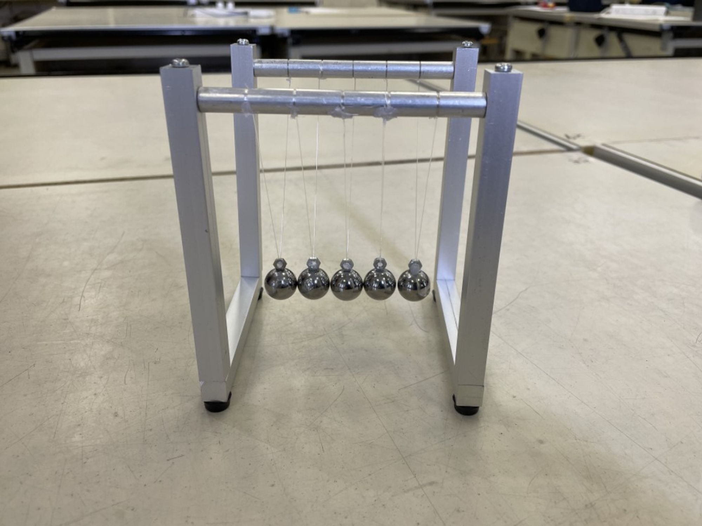
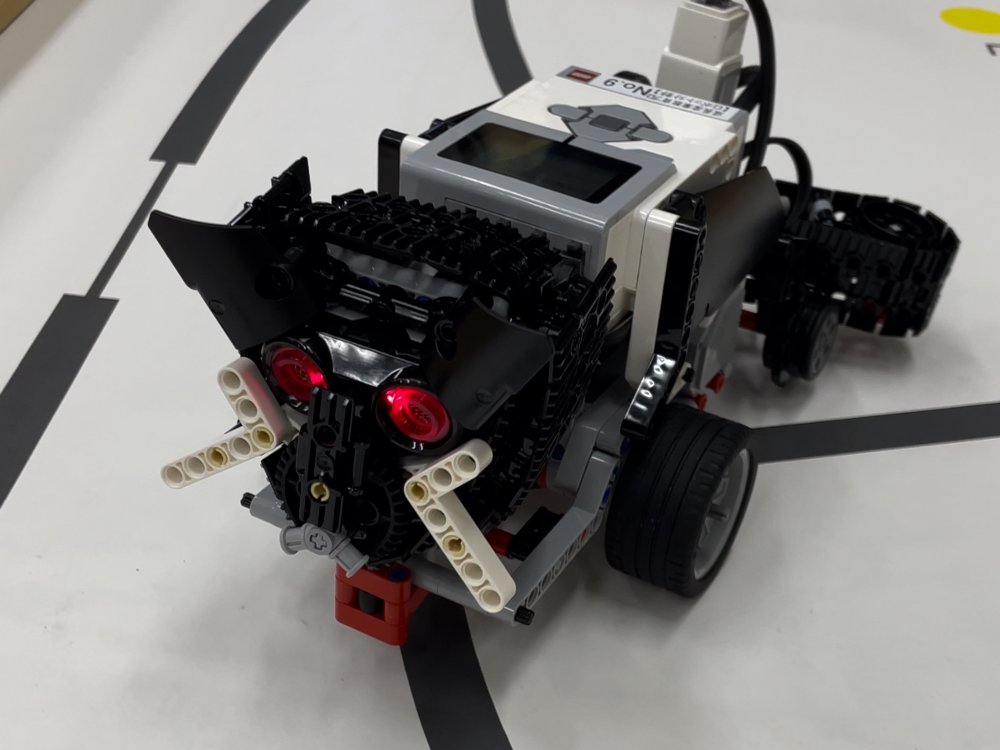
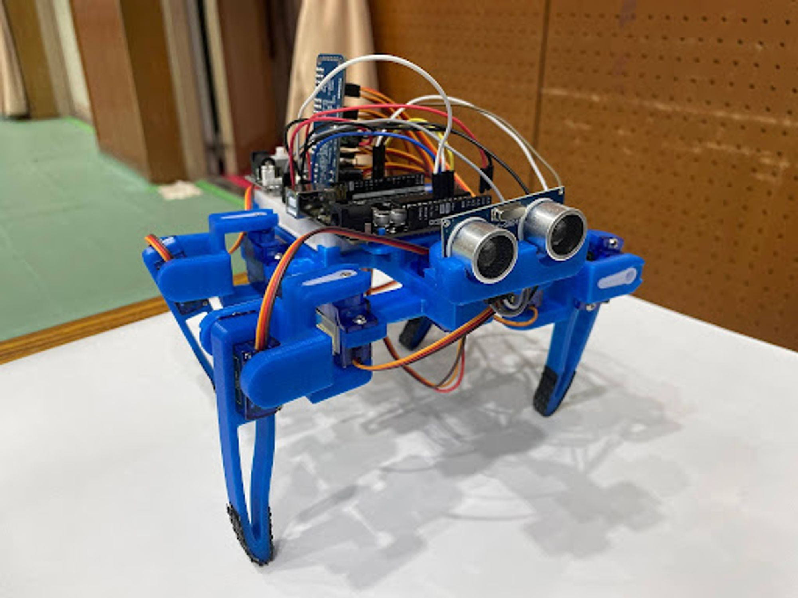
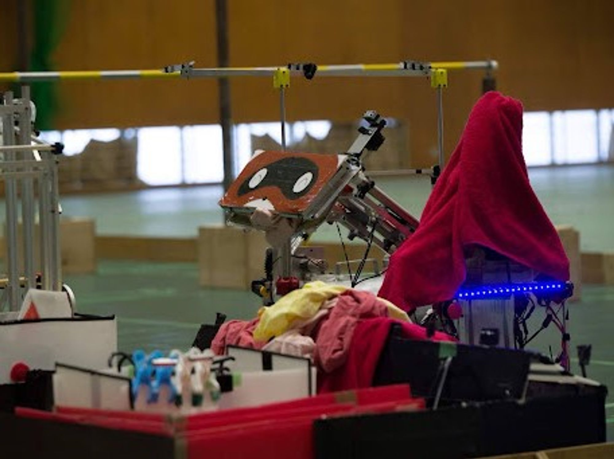
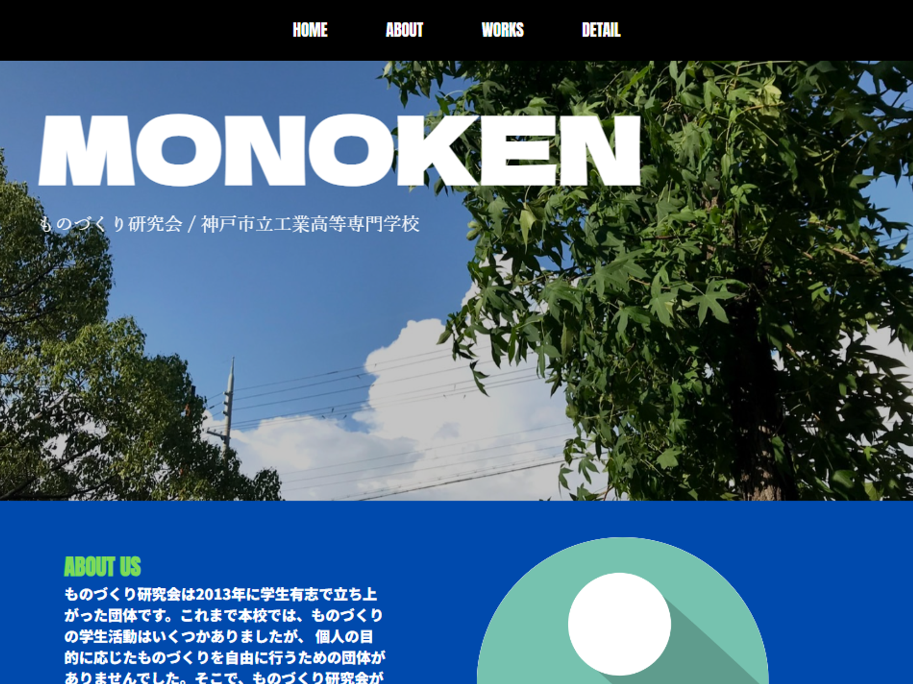
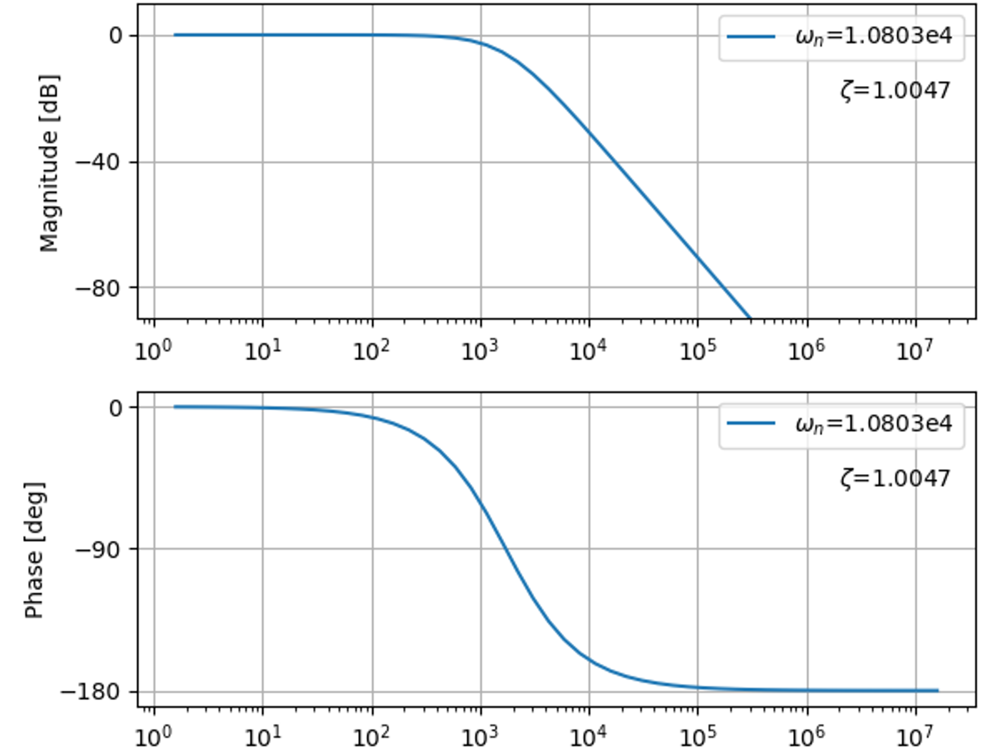
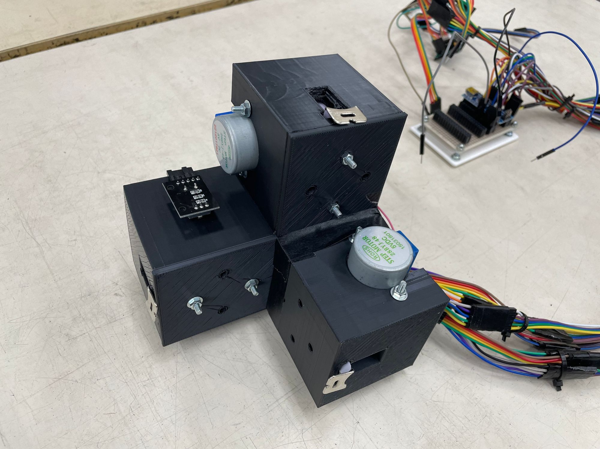
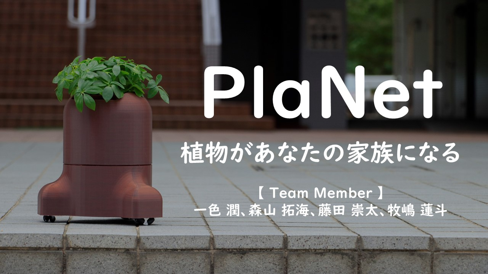

# My Portfolio - Megumu Isshiki

**Last Edit: 2024/06/27**

[**English version is here!**](https://www.notion.so/My-Portfolio-Megumu-Isshiki-3ec9112d0b68442696238fb820aa3410?pvs=21)

# Introduction

---

**Field of interest**: Human Computer Interaction, Tangible User Interface, More Than Human

**Affiliation**: 北海道大学 情報エレクトロニクス学科 情報理工学コース

🕊 [Facebook](https://www.facebook.com/profile.php?id=100035212147481&sk=about) | #️⃣ [Instagram](https://www.instagram.com/davinci_kcct/) | 💻 [GitHub](https://github.com/Davinci-Meg) | 📽️ [YouTube](https://youtube.com/@davinci_meg?si=iP2BZzgEu1kXAaiZ)

# Awards & Honors

---

### **Year 2019**

- 2019年度神戸市高校生シアトル派遣プログラム : [URL](https://www.kobe-kosen.ac.jp/kokusai/)
- 公益財団法人YFU日本国際交流財団 高校生留学派遣プログラム（ドイツへ１年間留学） : [URL](https://yfu.or.jp/)

### **Year 2023**

- Techno-Ocean 2023 水中ロボット競技会AUV部門 全体5位&ベストプレゼンテーション賞 (チーム) : [URL](http://ton23.underwaterrobonet.org/)
- 全国高等専門学校デザインコンペティション2023 AMデザイン部門 優秀賞 (チーム) : [URL](https://xn--tckf4c8j.com/docs.php?n=bumon4_kekka.pdf)
- 第17回近畿地区高等専門学校英語プレゼンテーションコンテスト 特別賞 : [URL](http://cocet.org/precon/2023/prelim.html)
- 全国高等専門学校GIRLsTechnologyコンテスト ダイバーシティ＆インクルージョン奨励賞(チーム) : [URL](https://gcon.kosen-k.go.jp/news/oDMPkYlf)

### **Year 2024**

- 国立情報学研究所 情報科学の達人プログラム2024 採択 : [URL](https://www.nii.ac.jp/tatsujin/)
- 第28回 一般社団法人情報処理学会シンポジウム INTERACTION2024 デモ発表（一般投票にて上位に選出） : [URL](https://www.interaction-ipsj.org/2024/)
- Project of the Year 2024/3DEXPERIENCE Edu, SOLIDWORKS prize(チーム) : [URL](https://youtu.be/M5Tu90vtmLs?si=zgNnyMZ5u8CpYRZi)
- 高専キャリア起業部2024 夏の全国大会 起業部ピッチ ソフトバンク賞：[URL](https://x.com/kosen_career/status/1830140405280882815?s=46)
- 高専キャリア起業部2024 夏の全国大会 起業部ピッチ DEEPCORE賞：[URL](https://x.com/kosen_career/status/1830140608717209895?s=46)
- 関西テック・クリエイター・チャレンジ CA(Cybernetic Avatar)集中講座 関西テック・クリエイター・チャレンジ賞 (チーム) : [URL](https://kansai-tcc.dle.or.jp/ca2024/)
- 経済産業省 令和5年度 未踏的な地方の若手人材発掘育成支援事業補助金「AKATSUKIプロジェクト」 採択事業「関西テック・クリエイター・チャレンジ CAコース」採択(採択金額: 550,000円): [URL](https://kansai-tcc.dle.or.jp/ca2024/)
- 国内最大級ハードウェアコンテストGUGEN2024 学生賞：[URL](https://x.com/GugenTheIdea/status/1867847196626014530)

### Year 2025

- Kobe City College of Technology The 43st Annual English Speaking Competition 1st Prize：[URL](https://www.kobe-kosen.ac.jp/activity/15155/)
- 一般社団法人 神戸市機械金属工業会 会長賞：[URL](https://www.kobe-kosen.ac.jp/activity/14799/)
- 情報処理学会第87回全国大会「情報科学の達人 5.0」ポスター発表 最優秀賞：[URL](https://x.com/Davinci_kcct/status/1913796393355059583)
- 一般社団法人Ezofrogs ハイブリッドイノベーター型人財育成プログラム 5期生採択（経産省「AKATSUKIプロジェクト」採択事業）：[URL](https://x.com/ezofrogs/status/1939332444534280270)
- STARTUP HOKKAIDO連携講義「社会課題を読み解き未来を生き抜くフューチャースキルを育てよう」 最終ピッチ 最優秀賞＆MVP賞：[URL](https://hokkaido-innovation-hunter.my.canva.site/futureskills)

# Publication

---

- 一色潤, 高田崚介, 3D CAD操作支援のための巻き尺を用いたサイズ感提示デバイスの開発, インタラクション2024, 巻, 号, pp. 59 -
- 森山拓海, 小澤正宜, 清水俊彦, Julien Amar, 酒井昌彦, 尾山匡浩, 田原熙昂, 一色潤, 早稲田一嘉 “植物ロボットによる動作とユーザーの感情想起の関係”, ロボティクス・メカトロニクス講演会 2025, pp. 1P1-K07

# Technical Skills

---

- Programming Languages: Python, C#
- Prototyping: Arduino, Fusion360, SolidWorks, Processing, Touch Designer
- Fabrication: 3D Printing

# Media Coverage

---

- Dassault Systèmes SolidWorks Corporation, “Japan Underwater Robot Team Wins Dassault Systemes POTY2024 SOLIDWORKS Brand Prize”, [URL](https://blogs.solidworks.com/teacher/2024/07/japan-underwater-robot-team-wins-solidworks-brand-prize-poty2024.html)

# Other Activities

---

- 高専キャリア起業部2024 夏の全国大会 「高専卒業後のキャリアパス、就職 or 大学編入？」登壇：[URL](https://x.com/kosen_career/status/1825138675342295134)
- 高専キャリア起業部2024 夏の全国大会 「動き出せ！高専生の挑戦記」登壇：[URL](https://x.com/kosen_career/status/1828338096297124284)
- DevFest2024 - Kwansai Developers Day 登壇：[URL](https://x.com/gdgkwansai/status/1869714299440021886)
- 高専キャリア2024 冬の全国大会「進学でも、就職でもない選択肢」登壇：[URL](https://x.com/kosen_career/status/1870323844982112421)
- 高専キャリア全国大会 2025 SPRING「「1歩目に悩むあなたへ」コンテストで世界はどう広がる？」登壇：[URL](https://x.com/kosen_career/status/1897226559351845371)

# Creations

---

<aside>
💡 Copyright, Megumu Isshiki, All rights reserved.

</aside>